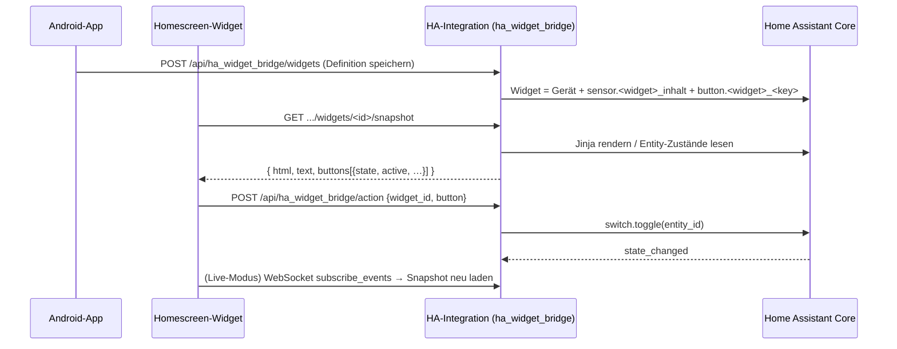

# HA Widget Bridge

[](https://my.home-assistant.io/redirect/hacs_repository/?owner=Harry3349&repository=ha-widget-bridge&category=integration)
[](https://github.com/hacs/integration)
[](https://github.com/Harry3349/ha-widget-bridge/actions/workflows/android.yml)

Ein **vollständig in Home Assistant integriertes Homescreen-Widget für Android** –
bestehend aus einer HACS-Integration und einer eigenen Android-App.

> ### ⚡ Schnellinstallation
> Auf den **HACS-Button oben** klicken: Home Assistant öffnet sich und fügt dieses Repository
> als benutzerdefinierte Integration (*Integration*) hinzu – danach „Herunterladen“ und HA neu starten.
>
> Beim ersten Klick fragt My Home Assistant einmalig nach der Adresse deiner Instanz.
> Alternativ manuell: HACS → Integrationen → ⋮ → Benutzerdefinierte Repositories →
> `https://github.com/Harry3349/ha-widget-bridge` → Kategorie *Integration*.

* **Buttons** direkt im Widget (z. B. Shellys schalten)
* **Anzeigen** direkt im Widget (z. B. Leistungen, USB-C-Power, Außentemperatur)
* Der Inhalt wird **serverseitig in Home Assistant gerendert** (Jinja oder automatisch)
* Jedes Widget erscheint in HA als **Gerät** mit Inhalts-Sensor und je einer **Button-Entity**
* Kein Cloud-Dienst, kein FCM, kein Abo – die App spricht direkt mit deiner Instanz

---

## Warum eine eigene App?

Die offizielle Companion-App hat Widgets, die **entweder** schalten **oder** anzeigen:

| Widget-Typ der HA-App | Kann schalten | Kann Werte zeigen |
|---|---|---|
| Action button | ✅ | ❌ |
| Entity State | ✅ (Toggle) | nur den Zustand einer Entity |
| Template | ❌ (Tippen = neu laden) | ✅ |

Ein einzelnes Widget mit mehreren Buttons **und** mehreren Messwerten ist damit nicht
möglich – das Template-Widget hat im Quellcode genau einen Klick-Handler (`UPDATE_VIEW`).
Diese Brücke schließt genau diese Lücke.

---

## Architektur



**Aufgabenteilung**

| Teil | Verantwortung |
|---|---|
| HACS-Integration | Widget-Definitionen speichern, Inhalt rendern, Entities bereitstellen, API + Dienste |
| Android-App | Widget-Definitionen bearbeiten, Homescreen-Widget zeichnen, Buttons auslösen, aktualisieren |

---

## Repository-Struktur

```
ha-widget-bridge/
├── custom_components/ha_widget_bridge/   # HACS-Integration (Python)
│   ├── __init__.py      # Setup, Dienste, View-Registrierung
│   ├── store.py         # Widget-Definitionen + Validierung (.storage)
│   ├── render.py        # Jinja- bzw. Auto-Rendering
│   ├── http.py          # JSON-API für die App
│   ├── sensor.py        # sensor.<widget>_inhalt
│   ├── button.py        # button.<widget>_<key>
│   └── config_flow.py   # Einrichtungsdialog
├── android/                              # Android-App (Kotlin + Compose)
│   └── app/src/main/java/de/reimann/hawidget/
│       ├── data/        # API-Client, Modelle, Einstellungen
│       ├── widget/      # AppWidgetProvider, Rendering, Konfigurations-Activity
│       ├── work/        # WorkManager-Worker + Live-Dienst
│       └── ui/          # Compose-Oberfläche
└── .github/workflows/android.yml         # baut die Debug-APK in CI
```

---

## 1. Integration installieren (HACS)

Voraussetzung: Home Assistant ≥ 2025.1 und HACS.

1. Dieses Verzeichnis als Git-Repository zu GitHub pushen (Repo: `Harry3349/ha-widget-bridge`):

   ```bash
   cd ha-widget-bridge
   git remote add origin https://github.com/Harry3349/ha-widget-bridge.git
   git push -u origin main
   ```

2. In Home Assistant: **HACS → Integrationen → ⋮ → Benutzerdefinierte Repositories**
   → `https://github.com/Harry3349/ha-widget-bridge` eintragen → Kategorie **Integration**
   → Hinzufügen.

   Schneller geht es mit dem HACS-Button oben im README: der öffnet Home Assistant und
   trägt das Repository automatisch ein.
3. Das Repository in HACS suchen → **Herunterladen** → Home Assistant neu starten.
4. **Einstellungen → Geräte & Dienste → Integration hinzufügen → „HA Widget Bridge“**
   → nur bestätigen (ein Eintrag verwaltet alle Widgets).

> Manuell statt HACS: den Ordner `custom_components/ha_widget_bridge/` nach
> `/config/custom_components/` kopieren und HA neu starten.

## 2. Android-App bauen

Die App braucht JDK 17 und das Android SDK (Android Studio installiert beides).

**a) Über GitHub Actions (ohne lokale Installation)**

Bei jedem Push läuft `.github/workflows/android.yml` und erzeugt ein Artefakt
`HAWidgetBridge-debug` mit der installierbaren Debug-APK.

**b) Lokal**

```bash
cd android
gradle wrapper --gradle-version 8.9     # einmalig
./gradlew assembleDebug
# → app/build/outputs/apk/debug/app-debug.apk
```

Oder: `android/` in Android Studio öffnen und „Run“ drücken.

## 3. App einrichten

1. In Home Assistant einen **Long-Lived Access Token** erzeugen:
   Profil (unten links) → Sicherheit → *Long-Lived Access Tokens* → Token erstellen.
2. In der App **Einrichtung**: Server-URL (z. B. `https://homeassistant.local:8123`)
   und Token eintragen → **Speichern** → **Testen**.
3. Optional: Aktualisierungsintervall (15–240 Minuten) und **Live-Modus**.

## 4. Widget anlegen

1. In der App **Widgets → Vorlage Shelly** (oder *Neu*) → Werte und Buttons anpassen
   → **Vorschau** → **Speichern**.
2. **Widget zum Homescreen hinzufügen** (oder am Homescreen lange drücken →
   Widgets → HA Widget Bridge → Widget platzieren).
3. Beim Platzieren erscheint die Auswahlliste, welches HA-Widget dargestellt wird.

---

## Beispiel: Shelly + USB-C + Außentemperatur

Die Vorlage in der App entspricht dieser Definition:

```json
{
  "id": "shelly",
  "name": "Shelly & Klima",
  "values": [
    { "entity": "sensor.dachboden_shelly_erik_3d_drucker_3ddrucker_leistung", "label": "3D-Drucker" },
    { "entity": "sensor.wohnzimmer_shelly_erik_pc_leistung", "label": "Erik PC" },
    { "entity": "sensor.schlafzimmer_shelly_erik_licht_leistung", "label": "Erik Licht" },
    { "entity": "sensor.wohnzimmer_usbc_power_pctisch_gesamtleistung", "label": "USB PC-Tisch" },
    { "entity": "sensor.schlafzimmer_usbc_power_nachttisch_gesamtleistung", "label": "USB Nacht" },
    { "entity": "sensor.sonoff_temp_luftfeuchte_04_temperatur", "label": "Außen", "color": "#4DD0E1" }
  ],
  "buttons": [
    { "key": "drucker", "label": "3D-Drucker", "icon": "mdi:printer-3d",
      "service": "switch.toggle", "entity_id": "switch.dachboden_shelly_erik_3d_drucker_3ddrucker" },
    { "key": "pc", "label": "Erik PC", "icon": "mdi:desktop-tower",
      "service": "switch.toggle", "entity_id": "switch.wohnzimmer_shelly_erik_pc" },
    { "key": "licht", "label": "Licht", "icon": "mdi:lightbulb",
      "service": "switch.toggle", "entity_id": "switch.schlafzimmer_shelly_erik_licht" }
  ]
}
```

Statt der automatischen Werteliste kann ein **Jinja-Template** genutzt werden
(App-Editor → *Eigenes Template*):

```jinja



<b>{{ name }}</b> ·
<font color='#ff5252'>offline</font>
<font color='#00e676'>{{ '%.1f'|format(s | float(0)) }} W</font>
<font color='#999999'>{{ '%.1f'|format(s | float(0)) }} W</font><br>

🌡️ <b>Außen</b> · {{ '%.1f'|format(states('sensor.sonoff_temp_luftfeuchte_04_temperatur') | float(0)) }} °C
```

---

## Widget-Definition (Schema)

| Feld | Typ | Bedeutung |
|---|---|---|
| `id` | Slug | eindeutige ID, wird aus `name` erzeugt, wenn leer |
| `name` | Text | Anzeigename und Gerätename in HA |
| `template` | Jinja | optional; ersetzt die automatische Werteliste |
| `values[]` | Liste | `entity`, optional `label`, `threshold` (W), `color` (Hex) |
| `buttons[]` | Liste (max. 6) | siehe unten |
| `text_size` | Zahl (8–30) | Schriftgröße im Widget |
| `theme` | Objekt | `background`, `text_color`, `accent`, `button_background`, `button_text` |

`buttons[]`:

| Feld | Bedeutung |
|---|---|
| `key` | eindeutiger Schlüssel (wird Button-Entity in HA) |
| `label` | Beschriftung im Widget |
| `icon` | `mdi:`-Name (siehe Hinweis unten) |
| `service` | z. B. `switch.toggle`, `light.toggle`, `script.turn_on` |
| `entity_id` | Ziel-Entity |
| `state_entity` | Entity, deren Zustand im Widget angezeigt wird (Standard: `entity_id`) |
| `service_data` | optionale zusätzliche Service-Daten |

---

## Entitäten und Dienste

Je Widget legt die Integration an:

* `sensor.<widget>_inhalt` – Klartext-Inhalt; vollständiges HTML im Attribut `html`
* `button.<widget>_<key>` – eine Entity pro Button (`button.press` löst sie aus)

Dienste:

```yaml
# Alle Widget-Inhalte neu rendern (oder eines)
service: ha_widget_bridge.refresh
data:
  widget_id: shelly

# Button drücken, wie im Widget
service: ha_widget_bridge.press
data:
  widget_id: shelly
  button: drucker
```

Damit lässt sich das Widget auch in Automationen, Dashboards oder per Sprachbefehl nutzen.

### Beispiel-Automation

```yaml
alias: 3D-Drucker nach Druckende ausschalten
triggers:
  - trigger: state
    entity_id: sensor.dachboden_sonic_pad_mqtt_bett_temperatur
    to: "0"
actions:
  - action: ha_widget_bridge.press
    data:
      widget_id: shelly
      button: drucker
```

---

## Aktualisierung im Widget

| Modus | Latenz | Kosten |
|---|---|---|
| Intervall (Standard 15 min) | bis 15 min | sehr gering, WorkManager |
| Tippen aufs Widget | sofort | ein Request |
| Button drücken | sofort | ein Request + ein Snapshot |
| Live-Modus | ~1–2 s | dauerhafte WebSocket-Verbindung + Benachrichtigung |

**Live-Modus** hält per WebSocket (`subscribe_events` auf `state_changed`) eine Verbindung zu
Home Assistant und lädt Snapshots gebündelt (max. alle 1,5 s) neu. Er ist in den
App-Einstellungen abschaltbar; ohne ihn aktualisiert das Widget alle 15 Minuten, beim
Antippen und nach jedem Button-Druck.

---

## Bekannte Einschränkungen

* **Symbole:** Die App bringt einen eigenen, kleinen Symbolsatz mit. `mdi:`-Namen werden über
  Schlüsselwörter zugeordnet (`printer`, `desktop`, `light`, `plug`, `therm`, `power`,
  `toggle`, sonst Standardsymbol).
* **Formatierung:** Der Widget-Inhalt wird über `Html.fromHtml` in eine `TextView` gerendert –
  möglich sind `<b>`, `<i>`, `<u>`, `<font color>`, `<br>`; **keine** Tabellen oder CSS-Layouts.
  Mehrfache Leerzeichen werden zusammengefasst.
* **Maximal 6 Buttons** und 12 Werte pro Widget, 25 Widgets.
* **Token:** Der Long-Lived-Token liegt in den App-einstellungen (Gerätespeicher). Die App ist
  von Cloud-Backups ausgenommen (`allowBackup=false`). Erzeuge am besten einen eigenen Token
  nur für diese App, damit du ihn jederzeit separat widerrufen kannst.
* **HTTP statt HTTPS:** Für lokale Instanzen ohne TLS ist Klartext-HTTP erlaubt
  (`usesCleartextTraffic`); im Heimnetz üblich, im fremden WLAN besser HTTPS nutzen.
* Die Debug-APK aus der CI ist mit dem Debug-Schlüssel signiert – für dauerhafte Nutzung
  einen eigenen Release-Key hinterlegen.

---

## Entwicklung

```bash
# Integration prüfen (ohne HA-Installation nur Syntax/Imports)
python3 -m compileall custom_components/ha_widget_bridge
python3 -m pyflakes  custom_components/ha_widget_bridge/*.py

# Logik-Tests ohne Home Assistant (Validierung, Rendering, Button-Zustände)
python3 tests/test_logik.py

# Statische Prüfungen für App, Ressourcen und Doku
python3 tools/check.py            # JSON/XML/YAML syntaktisch gültig?
python3 tools/check_resources.py  # lösen alle R.*- und @typ/name-Verweise auf?
python3 tools/check_kotlin.py     # Klammer-Balance der Kotlin-Dateien

# API von Hand testen
curl -H "Authorization: Bearer $TOKEN" https://HA/api/ha_widget_bridge/widgets
curl -H "Authorization: Bearer $TOKEN" https://HA/api/ha_widget_bridge/widgets/shelly/snapshot
```

Die Tests in `tests/test_logik.py` ersetzen die Home-Assistant-Module durch
Attrappen und laufen deshalb überall dort, wo Python ≥ 3.11 vorhanden ist.
`tools/check_kotlin.py` fängt Klammerfehler ab, die der Kotlin-Compiler erst
mit irreführenden Zeilennummern meldet.

Der Code der Integration kommt ohne Abhängigkeiten aus (`requirements: []`) und nutzt nur
stabile HA-Helfer (`Store`, `dispatcher`, `HomeAssistantView`).

## Lizenz

MIT – siehe [LICENSE](LICENSE).
