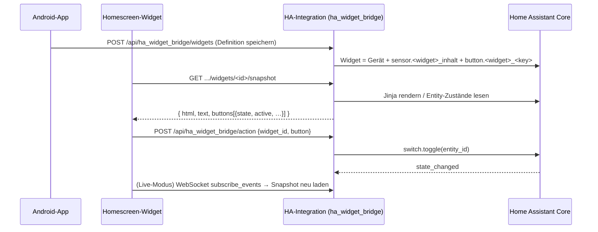

<p align="center">
  
</p>

# HA Widget Bridge

[](https://my.home-assistant.io/redirect/hacs_repository/?owner=Harry3349&repository=ha-widget-bridge&category=integration)
[](https://github.com/hacs/integration)
[](https://github.com/Harry3349/ha-widget-bridge/actions/workflows/android.yml)

Ein **vollständig in Home Assistant integriertes Homescreen-Widget für Android** –
bestehend aus einer HACS-Integration und einer eigenen Android-App.

> ### ⚡ Schnellinstallation
> Auf den **HACS-Button oben** klicken: Home Assistant öffnet sich und fügt dieses Repository
> als benutzerdefinierte Integration (*Integration*) hinzu – danach „Herunterladen“ und HA neu starten.
>
> Beim ersten Klick fragt My Home Assistant einmalig nach der Adresse deiner Instanz.
> Alternativ manuell: HACS → Integrationen → ⋮ → Benutzerdefinierte Repositories →
> `https://github.com/Harry3349/ha-widget-bridge` → Kategorie *Integration*.

* **Buttons** direkt im Widget (z. B. Shellys schalten)
* **Anzeigen** direkt im Widget (z. B. Leistungen, USB-C-Power, Außentemperatur)
* Der Inhalt wird **serverseitig in Home Assistant gerendert** (Jinja oder automatisch)
* Jedes Widget erscheint in HA als **Gerät** mit Inhalts-Sensor und je einer **Button-Entity**
* Kein Cloud-Dienst, kein FCM, kein Abo – die App spricht direkt mit deiner Instanz

---

## Warum eine eigene App?

Die offizielle Companion-App hat Widgets, die **entweder** schalten **oder** anzeigen:

| Widget-Typ der HA-App | Kann schalten | Kann Werte zeigen |
|---|---|---|
| Action button | ✅ | ❌ |
| Entity State | ✅ (Toggle) | nur den Zustand einer Entity |
| Template | ❌ (Tippen = neu laden) | ✅ |

Ein einzelnes Widget mit mehreren Buttons **und** mehreren Messwerten ist damit nicht
möglich – das Template-Widget hat im Quellcode genau einen Klick-Handler (`UPDATE_VIEW`).
Diese Brücke schließt genau diese Lücke.

---

## Architektur



**Aufgabenteilung**

| Teil | Verantwortung |
|---|---|
| HACS-Integration | Widget-Definitionen speichern, Inhalt rendern, Entities bereitstellen, API + Dienste |
| Android-App | Widget-Definitionen bearbeiten, Homescreen-Widget zeichnen, Buttons auslösen, aktualisieren |

---

## Repository-Struktur

```
ha-widget-bridge/
├── custom_components/ha_widget_bridge/   # HACS-Integration (Python)
│   ├── __init__.py      # Setup, Dienste, View-Registrierung
│   ├── store.py         # Widget-Definitionen + Validierung (.storage)
│   ├── render.py        # Jinja- bzw. Auto-Rendering
│   ├── http.py          # JSON-API für die App
│   ├── sensor.py        # sensor.<widget>_inhalt
│   ├── button.py        # button.<widget>_<key>
│   └── config_flow.py   # Einrichtungsdialog
├── android/                              # Android-Apps (Kotlin)
│   ├── app/src/main/java/de/reimann/hawidget/
│   │   ├── data/        # API-Client, Modelle, Einstellungen
│   │   ├── widget/      # AppWidgetProvider, Rendering, Konfigurations-Activity
│   │   ├── work/        # WorkManager-Worker + Live-Dienst
│   │   ├── wear/        # Überträgt den Snapshot an die Uhr (Data Layer)
│   │   └── ui/          # Compose-Oberfläche
│   └── wear/src/main/java/de/reimann/hawidget/wear/
│       ├── tile/        # Tile (Werte + Buttons) und Rendering
│       ├── bridge/      # Empfängt den Snapshot der Handy-App
│       └── data/        # Snapshot-Modell, Zwischenspeicher, Bridge-Nachrichten
└── .github/workflows/android.yml         # baut beide Debug-APKs in CI
```

---

## 1. Integration installieren (HACS)

Voraussetzung: Home Assistant ≥ 2025.1 und HACS.

1. Dieses Verzeichnis als Git-Repository zu GitHub pushen (Repo: `Harry3349/ha-widget-bridge`):

   ```bash
   cd ha-widget-bridge
   git remote add origin https://github.com/Harry3349/ha-widget-bridge.git
   git push -u origin main
   ```

2. In Home Assistant: **HACS → Integrationen → ⋮ → Benutzerdefinierte Repositories**
   → `https://github.com/Harry3349/ha-widget-bridge` eintragen → Kategorie **Integration**
   → Hinzufügen.

   Schneller geht es mit dem HACS-Button oben im README: der öffnet Home Assistant und
   trägt das Repository automatisch ein.
3. Das Repository in HACS suchen → **Herunterladen** → Home Assistant neu starten.
4. **Einstellungen → Geräte & Dienste → Integration hinzufügen → „HA Widget Bridge“**
   → nur bestätigen (ein Eintrag verwaltet alle Widgets).

> Manuell statt HACS: den Ordner `custom_components/ha_widget_bridge/` nach
> `/config/custom_components/` kopieren und HA neu starten.

## 2. Android-App bauen

Die App braucht JDK 17 und das Android SDK (Android Studio installiert beides).

**a) Über GitHub Actions (ohne lokale Installation)**

Bei jedem Push läuft `.github/workflows/android.yml` und erzeugt zwei Artefakte:
`HAWidgetBridge-debug` (Handy) und `HAWidgetBridge-wear-debug` (Uhr).

Die fertigen APKs hängen zusätzlich an jedem
[Release](https://github.com/Harry3349/ha-widget-bridge/releases/latest) – das ist der
einfachste Weg, sie direkt auf dem Handy herunterzuladen und zu installieren.

**b) Lokal**

```bash
cd android
gradle wrapper --gradle-version 8.9     # einmalig
./gradlew assembleDebug                 # beide Module
# → app/build/outputs/apk/debug/app-debug.apk
# → wear/build/outputs/apk/debug/app-debug.apk
```

Oder: `android/` in Android Studio öffnen und „Run“ drücken.

## 3. App einrichten

1. In Home Assistant einen **Long-Lived Access Token** erzeugen:
   Profil (unten links) → Sicherheit → *Long-Lived Access Tokens* → Token erstellen.
2. In der App **Einrichtung**: Server-URL (z. B. `https://homeassistant.local:8123`)
   und Token eintragen → **Speichern** → **Testen**.
3. Optional: Aktualisierungsintervall (15–240 Minuten) und **Live-Modus**.

## 4. Widget anlegen

1. In der App **Widgets → Vorlage Shelly** (oder *Neu*) → Werte und Buttons anpassen
   → **Vorschau** → **Speichern**.
2. **Widget zum Homescreen hinzufügen** (oder am Homescreen lange drücken →
   Widgets → HA Widget Bridge → Widget platzieren).
3. Beim Platzieren erscheint die Auswahlliste, welches HA-Widget dargestellt wird.

## 5. Wear OS (Uhr)

Das Wear-Modul zeigt dasselbe Widget als **Tile** auf der Uhr – mit Werten **und**
Buttons in einer Oberfläche, im selben Aufbau wie am Handy (Titel + Stand, Buttons,
darunter die Werte als Raster mit dem Namen über dem Wert – Spaltenzahl und
„Wert unter dem Namen“ kommen aus der Widget-Definition).

**Die Daten kommen über das Handy.** Eine Uhr ist meist nicht im WLAN, deshalb holt
**nicht** die Uhr selbst die Daten aus Home Assistant, sondern die Handy-App:

```
Home Assistant ──HTTP──▶ Handy-App ──Wearable Data Layer──▶ Tile auf der Uhr
        ▲                     │
        └──── Klick ──────────┘   (Uhr schickt nur „Button gedrückt“)
```

* Die Handy-App legt nach jedem Abruf (Intervall, Live-Modus, Antippen, Button) den
  Snapshot für die Uhr ab – auch wenn die Handy-App geschlossen ist, weckt der
  Data-Layer-Dienst sie.
* Die Uhr zeigt den zwischengespeicherten Snapshot und schickt nur kurze Nachrichten:
  „Button gedrückt“ (Handy schaltet und schickt den neuen Stand zurück) und „bitte
  aktualisieren“ (Handy holt einen frischen Stand).
* Auf der Uhr sind dafür **kein** Token und **keine** Serveradresse nötig – sie hat
  keine Netzverbindung zu Home Assistant.

**Einrichten**

1. Handy-App mit Server-URL und Token einrichten (Abschnitt 3) – das ist die einzige
   Stelle mit Zugangsdaten.
2. Wear-APK (`HAWidgetBridge-*-wear-debug.apk`) auf der Uhr installieren
   (Abschnitt 2, am einfachsten per `adb install -r`).
3. Auf der Uhr nach rechts wischen (Tiles-Karussell) → **Tile hinzufügen** → *HA Widget*.
   Beim Anzeigen bittet die Tile das Handy selbst um den ersten Stand.

**Warum Tile und nicht „Wear Widget“?** Die neuen Wear Widgets (Remote Compose) brauchen
ein Gerät mit Teilhöhen-Unterstützung; auf Geräten **ohne** Teilhöhen – wie der Pixel
Watch 3 – übersetzt das System sie ohnehin in eine Tile. Deshalb nutzt dieses Modul die
stabile `androidx.wear.tiles`-Bibliothek.

**Aktualisierung**

| Anlass | Verhalten |
|---|---|
| Tile wird angezeigt | Zwischenspeicher wird gezeichnet; ist der Stand älter als 60 s, bittet die Tile das Handy um einen frischen Abruf |
| Handy-Abruf (alle 15 min, Live-Modus, Antippen, Button) | Snapshot wird sofort an die Uhr übertragen, die Tile zeichnet sich neu |
| Button auf der Tile | Nachricht ans Handy → Schalten in HA → neuer Stand zurück (Rückmeldung in ~1 s) |
| Fehler beim Schalten | Handy meldet es zurück, die Tile zeigt „Druck fehlgeschlagen“ |

Die Tile kann nicht scrollen – es passt deshalb eine begrenzte Zahl von Werten auf den
Bildschirm.

### Volle Liste mit Scrollen (Wischen und Krone)

Wear OS-Kacheln können laut Google **nicht** gescrollt werden. Sobald die Zeilen nicht
mehr ganz auf die Kachel passen (der Editor zeigt am Handy, ab welcher Zeile das so ist),
blendet die Kachel den Hinweis **„Antippen: alle Zeilen, mit Wischen oder Krone“** ein.
Ein Tipp irgendwo auf die Kachel öffnet dann die App-Ansicht auf der Uhr:

* dieselben Zeilen wie Kachel und Handy-Widget (Text, Sensor, Button, mit Ausrichtung
  und Schriftgröße aus dem Editor),
* scrollbar **mit dem Finger** und **mit der Krone** (Drehknopf) – die Krone bewegt die
  Liste in Rastschritten,
* Buttons schalten wie auf der Kachel (Nachricht ans Handy, Rückmeldung ~1 s).

Die Ansicht liegt zusätzlich in der App-Liste der Uhr und heißt dort *HA Widget*.
Dadurch lässt sie sich auch öffnen, ohne zur Kachel zu wischen.


---

## Beispiel: Shelly + USB-C + Außentemperatur

Die Vorlage in der App entspricht dieser Definition:

```json
{
  "id": "shelly",
  "name": "Shelly & Klima",
  "values": [
    { "entity": "sensor.dachboden_shelly_erik_3d_drucker_3ddrucker_leistung", "label": "3D-Drucker" },
    { "entity": "sensor.wohnzimmer_shelly_erik_pc_leistung", "label": "Erik PC" },
    { "entity": "sensor.schlafzimmer_shelly_erik_licht_leistung", "label": "Erik Licht" },
    { "entity": "sensor.wohnzimmer_usbc_power_pctisch_gesamtleistung", "label": "USB PC-Tisch" },
    { "entity": "sensor.schlafzimmer_usbc_power_nachttisch_gesamtleistung", "label": "USB Nacht" },
    { "entity": "sensor.sonoff_temp_luftfeuchte_04_temperatur", "label": "Außen", "color": "#4DD0E1" }
  ],
  "buttons": [
    { "key": "drucker", "label": "3D-Drucker", "icon": "mdi:printer-3d",
      "service": "switch.toggle", "entity_id": "switch.dachboden_shelly_erik_3d_drucker_3ddrucker" },
    { "key": "pc", "label": "Erik PC", "icon": "mdi:desktop-tower",
      "service": "switch.toggle", "entity_id": "switch.wohnzimmer_shelly_erik_pc" },
    { "key": "licht", "label": "Licht", "icon": "mdi:lightbulb",
      "service": "switch.toggle", "entity_id": "switch.schlafzimmer_shelly_erik_licht" }
  ]
}
```

Statt der automatischen Werteliste kann ein **Jinja-Template** genutzt werden
(App-Editor → *Eigenes Template*):

```jinja



<b>{{ name }}</b> ·
<font color='#ff5252'>offline</font>
<font color='#00e676'>{{ '%.1f'|format(s | float(0)) }} W</font>
<font color='#999999'>{{ '%.1f'|format(s | float(0)) }} W</font><br>

🌡️ <b>Außen</b> · {{ '%.1f'|format(states('sensor.sonoff_temp_luftfeuchte_04_temperatur') | float(0)) }} °C
```

---

## Werte anordnen

Im Abschnitt **Werte** des Editors stellst du die Anordnung ein:

| Einstellung | Wirkung |
|---|---|
| **Nebeneinander: 1 Spalte** | Ein Wert pro Zeile (Standard) |
| **Nebeneinander: 2 / 3 Spalten** | Die Werte stehen nebeneinander, gefüllt von links nach rechts |
| **Wert unter dem Namen** | Im Feld steht der Name in der ersten Zeile, der Wert darunter |

Bei mehreren Spalten ordnet die **App** die Werte an – das Widget-Layout enthält dafür
feste, ausblendbare Felder, weil `RemoteViews` keine Views zur Laufzeit erzeugen kann.
Ein gesetztes **Jinja-Template** ersetzt weiterhin die Werteliste und füllt den
HTML-Bereich.

---

## Zeilen-Layout (Handy und Uhr)

Der Abschnitt **Zeilen (Handy + Uhr)** im Editor ist der freie Aufbau: Du legst Zeilen
an, und in jede Zeile kommen **bis zu drei Objekte** – Text, Sensor (Entity-Wert) oder
Button. Die Zeilen gelten **gleichzeitig für das Widget auf dem Handy und die Kachel auf
der Uhr**, weil beide dieselbe Definition aus Home Assistant zeichnen (die Uhr bekommt
sie über den Data Layer vom Handy).

| Einstellung pro Objekt | Bedeutung |
|---|---|
| **Text** | fester Text (z. B. eine Überschrift) – frei eintippbar |
| **Sensor** | Auswahl aus der Liste **Werte** oben; die Beschriftung von dort wird übernommen und kann pro Zeile überschrieben werden – bleibt das Namensfeld leer, wird **nur der Wert** angezeigt |
| **Button** | Auswahl aus der Liste **Buttons** oben (Beschriftung, Service, Symbol kommen von dort) |
| **Ausrichtung** | links, mittig oder rechts – innerhalb des Platzes, den das Objekt in der Zeile bekommt |
| **Schriftgröße** | 8–30 sp, unabhängig pro Objekt |
| **Breite** | Anteil der Zeilenbreite in Prozent (z. B. 30 / 70); `0` oder leer = die Objekte teilen sich die Zeile gleichmäßig |
| **An/Aus** | gilt pro Button und wird im Abschnitt *Buttons* ein-/ausgeschaltet |

Bei Prozentangaben bekommen die übrigen Objekte der Zeile den Rest gleichmäßig. Am Handy
wirken die eigenen Breiten ab Android 12 (dort kann `RemoteViews` die Breite setzen); auf
älteren Geräten teilen sich die Blöcke weiterhin die Zeile. Uhr-Kachel und Uhr-App nutzen
die Breiten unabhängig von der Android-Version.

Sensoren und Buttons werden also **oben** angelegt (im Abschnitt *Werte* beziehungsweise
*Buttons*) – dort werden sie aus Home Assistant ausgewählt und benannt. Im Zeilen-Editor
wählst du sie anschließend über ein **Aufklapp-Menü** aus; wird ein Eintrag oben gelöscht,
markiert der Editor die betroffenen Objekte mit „nicht mehr in der Liste oben“.

### Was die Uhr zeigt (Einstellungen in der Handy-App)

Der Abschnitt **Uhr** im Editor steuert die Uhr – alles andere ergibt sich aus denselben
Zeilen wie am Handy:

| Einstellung | Wirkung |
|---|---|
| **Auf der Uhr anzeigen** (Schalter je Zeile) | Aus = die Zeile erscheint nur im Widget am Handy |
| **Zeilen auf der Kachel** | `0` = automatisch (so viele, wie hineinpassen), sonst genau diese Zahl |
| **Schriftgröße** | 60–180 % – vergrößert/verkleinert alle Texte auf der Uhr |

Die Kachel zeigt nur, was ganz auf die runde Anzeige passt; für den Rest blendet sie den
Hinweis **„Antippen: alle Zeilen“** ein (Kacheln können laut Wear OS nicht scrollen). Ein
Tipp auf die Kachel öffnet die App auf der Uhr mit allen ausgewählten Zeilen – dort lässt
sich mit **Wischen** oder mit der **Krone** scrollen.

Die Objekte einer Zeile teilen sich die Breite: ein Objekt füllt die ganze Zeile, zwei
je die Hälfte, drei je ein Drittel. Sobald **mindestens eine Zeile** angelegt ist,
ersetzt dieses Layout die Werteliste und die Button-Zeilen auf beiden Flächen.

### Hinweise zur Größe

Unter der Zeilenliste stehen zwei Hinweise, die sich aus den eingestellten Zeilen
ergeben:

* **Handy:** ab welcher Zeile das Widget höher gezogen werden muss
  (≈ 105 dp ≈ 2 Launcher-Reihen, 180 dp ≈ 3, 255 dp ≈ 4). Reicht selbst das nicht,
  empfiehlt der Hinweis eine zweite Zeile oder ein zweites Widget.
* **Uhr:** bis zu welcher Zeile alles gleichzeitig sichtbar ist und ab welcher Zeile
  gescrollt werden muss (runde Anzeige, ca. 150 dp).

Zwischen den Zeilen markiert der Editor die Grenzen zusätzlich
(„Ab hier braucht das Handy-Widget mehr Höhe“ / „Ab hier muss auf der Uhr gescrollt
werden“). Die Werte sind Erfahrungswerte – die tatsächliche Kachelgröße hängt vom
Launcher bzw. von der Uhr ab.

## Hintergrund

Der Widget-Hintergrund ist **standardmäßig durchsichtig** (`theme.background` =
`#00000000`), sodass der Homescreen durchscheint; nur die Werte und die Button-Flächen
haben eine eigene Farbe. Ein eigener Kasten ist weiterhin möglich, z. B.
`"theme": { "background": "#E6101018" }` (die ersten beiden Stellen sind der
Alpha-Wert: `00` durchsichtig … `FF` deckend).

---

## Widget-Definition (Schema)

| Feld | Typ | Bedeutung |
|---|---|---|
| `id` | Slug | eindeutige ID, wird aus `name` erzeugt, wenn leer |
| `name` | Text | Anzeigename und Gerätename in HA |
| `template` | Jinja | optional; ersetzt die automatische Werteliste |
| `values[]` | Liste | `entity`, optional `label`, `threshold` (W), `color` (Hex) |
| `buttons[]` | Liste (max. 6) | siehe unten |
| `rows[]` | Liste (max. 8) | Zeilen-Layout für Handy **und** Uhr, siehe unten |
| `watch_rows` | Zahl (0–8) | Zeilen auf der Uhr-Kachel; `0` = automatisch |
| `watch_scale` | Zahl (0.6–1.8) | Schriftgrößen-Faktor für die Uhr (1.0 = unverändert) |
| `text_size` | Zahl (8–30) | Schriftgröße im Widget |
| `value_columns` | Zahl (1–3) | 1 = Werte untereinander, 2/3 = nebeneinander |
| `value_label_above` | true/false | `true` = Name oben, Wert darunter (Standard: `Name · Wert` in einer Zeile) |
| `theme` | Objekt | `background` (Standard `#00000000` = durchsichtig), `text_color`, `accent`, `button_background`, `button_text` |

`buttons[]`:

| Feld | Bedeutung |
|---|---|
| `key` | eindeutiger Schlüssel (wird Button-Entity in HA) |
| `label` | Beschriftung im Widget |
| `icon` | `mdi:`-Name (siehe Hinweis unten) |
| `show_state` | `false` = kein „An/Aus“ neben der Beschriftung (Standard: `true`) |
| `service` | z. B. `switch.toggle`, `light.toggle`, `script.turn_on` |
| `entity_id` | Ziel-Entity |
| `state_entity` | Entity, deren Zustand im Widget angezeigt wird (Standard: `entity_id`) |
| `service_data` | optionale zusätzliche Service-Daten |

`rows[]` (jede Zeile `{ "items": [ … ] }` mit maximal drei Objekten):

| Feld | Bedeutung |
|---|---|
| `type` | `text`, `sensor` oder `button` |
| `watch` | `false` = diese Zeile nur am Handy zeigen (Standard: `true`) |
| `align` | `left`, `center` (Standard) oder `right` |
| `size` | Schriftgröße des Objekts (8–30, Standard: `text_size`) |
| `width` | Breite des Blocks in Prozent der Zeile (0–100, Standard: `0` = gleichmäßig) |
| `color` | optionale Hex-Farbe (bei `sensor` sonst die automatische Farbe) |
| `text` | nur `text`: der angezeigte Text |
| `entity`, `label`, `threshold` | nur `sensor` |
| `key`, `label`, `icon`, `service`, `entity_id`, `state_entity` | nur `button` (wie in `buttons[]`; jeder Zeilen-Button ist ebenfalls eine Button-Entity in HA) |

```json
"rows": [
  { "items": [ { "type": "text", "text": "Wohnzimmer", "align": "left", "size": 16 } ] },
  { "items": [
      { "type": "button", "key": "licht", "label": "Licht", "icon": "mdi:lightbulb",
        "service": "light.toggle", "entity_id": "light.wohnzimmer", "align": "left", "size": 14 },
      { "type": "sensor", "entity": "sensor.sonoff_temp_luftfeuchte_04_temperatur",
        "label": "Außen", "align": "right", "size": 14 }
  ] }
]
```

---

## Entitäten und Dienste

Je Widget legt die Integration an:

* `sensor.<widget>_inhalt` – Klartext-Inhalt; vollständiges HTML im Attribut `html`
* `button.<widget>_<key>` – eine Entity pro Button (`button.press` löst sie aus)

Dienste:

```yaml
# Alle Widget-Inhalte neu rendern (oder eines)
service: ha_widget_bridge.refresh
data:
  widget_id: shelly

# Button drücken, wie im Widget
service: ha_widget_bridge.press
data:
  widget_id: shelly
  button: drucker
```

Damit lässt sich das Widget auch in Automationen, Dashboards oder per Sprachbefehl nutzen.

### Beispiel-Automation

```yaml
alias: 3D-Drucker nach Druckende ausschalten
triggers:
  - trigger: state
    entity_id: sensor.dachboden_sonic_pad_mqtt_bett_temperatur
    to: "0"
actions:
  - action: ha_widget_bridge.press
    data:
      widget_id: shelly
      button: drucker
```

---

## Aktualisierung im Widget

| Modus | Latenz | Kosten |
|---|---|---|
| Intervall (Standard 15 min) | bis 15 min | sehr gering, WorkManager |
| Tippen aufs Widget | sofort | ein Request |
| Button drücken | sofort | ein Request + ein Snapshot |
| Live-Modus | ~1–2 s | dauerhafte WebSocket-Verbindung + Benachrichtigung |

**Aktualisiert wird nur, wenn der Bildschirm an ist.** Ein Homescreen-Widget ist nur dann
zu sehen, und Android bietet keinen „Widget ist sichtbar“-Callback – deshalb prüfen die
Worker den Bildschirmzustand (`PowerManager.isInteractive()`) und überspringen den Abruf
sonst. Im Standby entfallen damit Funk- und Serverlast; der nächste Abruf holt den
aktuellen Stand nach. Sofort aktuell ist das Widget außerdem beim Antippen, nach einem
Button-Druck und beim Öffnen der App.

**Live-Modus** hält per WebSocket (`subscribe_events` auf `state_changed`) eine Verbindung zu
Home Assistant und lädt Snapshots gebündelt (max. alle 1,5 s) neu. Er ist in den
App-Einstellungen abschaltbar; ohne ihn aktualisiert das Widget alle 15 Minuten, beim
Antippen und nach jedem Button-Druck. Bei ausgeschaltetem Bildschirm trennt der Dienst die
Verbindung und verbindet sich beim Einschalten neu – dann wird sofort aktualisiert.

**Nach einem Home-Assistant-Neustart** verbindet sich der Live-Modus selbsttätig wieder:
Ein Wächter prüft alle 15 s, ob eine Verbindung besteht, baut sie bei Bedarf neu auf und
holt sofort einen frischen Snapshot (der Fehlerhinweis im Widget verschwindet damit von
allein). Die Dauerbenachrichtigung zeigt den Zustand („Live-Verbindung steht“ bzw.
„Live-Verbindung wird neu aufgebaut …“). Ohne Live-Modus aktualisiert sich das Widget beim
nächsten Intervall, beim Antippen oder beim Öffnen der App.

---

## Fehlersuche

### Der HACS-Button meldet „Repository … nicht gefunden“

Die My-Home-Assistant-Seite prüft das Repository **im Browser** über die GitHub-API
(`api.github.com`). Unangemeldet erlaubt GitHub nur 60 Abfragen pro Stunde **pro IP-Adresse** –
und HACS selbst verbraucht davon ebenfalls welche. Die Meldung kann also auftreten, obwohl das
Repository öffentlich und in Ordnung ist.

1. **Gegentest:** `https://api.github.com/repos/Harry3349/ha-widget-bridge` im Browser öffnen.
   * JSON sichtbar → alles in Ordnung, Seite neu laden (hilft auch ein Inkognito-Fenster).
   * „API rate limit exceeded“ → Limit abwarten (Reset stündlich).
2. **Ohne My Home Assistant:** HACS → ⋮ (oben rechts) → *Benutzerdefinierte Repositories* →
   `https://github.com/Harry3349/ha-widget-bridge` → Typ **Integration** → *HINZUFÜGEN*.
3. **Ganz ohne HACS:** den Ordner `custom_components/ha_widget_bridge/` nach
   `/config/custom_components/` kopieren, Home Assistant neu starten und die Integration unter
   *Einstellungen → Geräte & Dienste → Integration hinzufügen* einrichten.

### Integration taucht nach dem Neustart nicht auf

* Prüfen, ob `/config/custom_components/ha_widget_bridge/manifest.json` existiert.
* Log ansehen (`/config/home-assistant.log`) – Fehler beim Laden werden dort mit
  `ha_widget_bridge` aufgeführt.
* Nach dem Kopieren **muss** Home Assistant neu gestartet werden (kein YAML-Reload).

### Widget sieht nach einem Home-Assistant-Neustart wieder „alt“ aus

Das Widget zeigt dann wieder eine Spalte und `Name · Wert` in einer Zeile (statt mehrerer
Spalten und dem Wert unter dem Namen). Ursache ist meist die **Integration**, nicht das Widget:

1. HACS installiert beim Aktualisieren/Neu-Herunterladen den Inhalt des **letzten Release-Tags**.
   Ist der Code seit dem letzten Release weiterentwickelt worden, überschreibt HACS die neuere
   Fassung mit der älteren. Prüfen: `manifest.json` der Installation vergleichen mit
   `manifest.json` des Release-Tags.
2. Abhilfe: in HACS auf die **neueste Version** aktualisieren und Home Assistant neu starten.
3. Beim Rücksprung auf eine ältere Integration gehen die Felder `value_columns` und
   `value_label_above` der gespeicherten Definition verloren (die alte Fassung kennt sie nicht).
   Nach dem Update im App-Editor die Spaltenzahl und „Wert unter dem Namen“ **erneut** einstellen.

Grundsatz: Wenn HACS das Repository verwaltet, die Integration **ausschließlich über HACS**
aktualisieren und keine Handkopie parallel pflegen.

### Widget bleibt leer / zeigt „Fehler“

* In der App **Einrichtung → Testen** ausführen; die Meldung nennt den HTTP-Fehler.
* Häufigste Ursache: Token abgelaufen/widerrufen oder falsche Basis-URL
  (mit `https://` und Port, z. B. `https://homeassistant.local:8123`).
* Das Widget zeigt bei Netzproblemen den zuletzt bekannten Stand weiter an (Cache);
  die kleine Zeile oben rechts nennt dann den Fehler.
* Nach einem Home-Assistant-Neustart erholt sich das Widget im Live-Modus innerhalb von
  etwa 15 Sekunden von selbst. Ohne Live-Modus hilft Antippen, ein Button-Druck oder das
  Öffnen der App – oder das nächste Intervall abwarten.

## Bekannte Einschränkungen

* **Symbole:** Die App bringt einen eigenen, kleinen Symbolsatz mit. `mdi:`-Namen werden über
  Schlüsselwörter zugeordnet (`printer`, `desktop`, `light`, `plug`, `therm`, `power`,
  `toggle`, sonst Standardsymbol).
* **Formatierung:** Die Werte-Felder ordnet die App selbst an (1–3 Spalten, Name
  darüber oder davor). Der **Template**-Inhalt wird über `Html.fromHtml` in eine `TextView`
  gerendert – möglich sind `<b>`, `<i>`, `<u>`, `<font color>`, `<br>`; **keine** Tabellen
  oder CSS-Layouts. Mehrfache Leerzeichen werden zusammengefasst.
* **Maximal 6 Buttons** und 12 Werte pro Widget, 25 Widgets.
* **Token:** Der Long-Lived-Token liegt in den App-einstellungen (Gerätespeicher). Die App ist
  von Cloud-Backups ausgenommen (`allowBackup=false`). Erzeuge am besten einen eigenen Token
  nur für diese App, damit du ihn jederzeit separat widerrufen kannst.
* **HTTP statt HTTPS:** Für lokale Instanzen ohne TLS ist Klartext-HTTP erlaubt
  (`usesCleartextTraffic`); im Heimnetz üblich, im fremden WLAN besser HTTPS nutzen.
* Die Debug-APK aus der CI ist mit dem Debug-Schlüssel signiert – für dauerhafte Nutzung
  einen eigenen Release-Key hinterlegen.

---

## Entwicklung

```bash
# Integration prüfen (ohne HA-Installation nur Syntax/Imports)
python3 -m compileall custom_components/ha_widget_bridge
python3 -m pyflakes  custom_components/ha_widget_bridge/*.py

# Logik-Tests ohne Home Assistant (Validierung, Rendering, Button-Zustände)
python3 tests/test_logik.py

# Statische Prüfungen für App, Ressourcen und Doku
python3 tools/check.py            # JSON/XML/YAML syntaktisch gültig?
python3 tools/check_resources.py  # lösen alle R.*- und @typ/name-Verweise auf?
python3 tools/check_kotlin.py     # Klammer-Balance der Kotlin-Dateien

# Markensymbol der Integration neu erzeugen (brand/icon.png …, benötigt Pillow)
python3 tools/make_brand_icon.py

# API von Hand testen
curl -H "Authorization: Bearer $TOKEN" https://HA/api/ha_widget_bridge/widgets
curl -H "Authorization: Bearer $TOKEN" https://HA/api/ha_widget_bridge/widgets/shelly/snapshot
```

Die Tests in `tests/test_logik.py` ersetzen die Home-Assistant-Module durch
Attrappen und laufen deshalb überall dort, wo Python ≥ 3.11 vorhanden ist.
`tools/check_kotlin.py` fängt Klammerfehler ab, die der Kotlin-Compiler erst
mit irreführenden Zeilennummern meldet.

Der Code der Integration kommt ohne Abhängigkeiten aus (`requirements: []`) und nutzt nur
stabile HA-Helfer (`Store`, `dispatcher`, `HomeAssistantView`).

## Lizenz

MIT – siehe [LICENSE](LICENSE).
